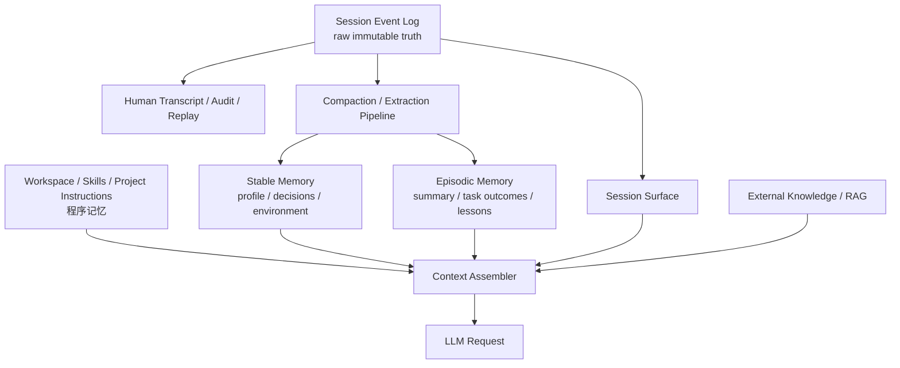
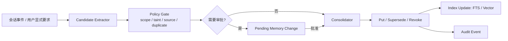

# Pulse v2 Memory Layer：业界调研、抽象与落地设计

> 状态：设计草案（用于后续空骨架 PR 与实现拆分）  
> 更新时间：2026-08-26  
> 范围：为 Pulse v2 的 P2「记忆与会话」建立实现边界、数据模型和推进顺序；不直接复活 v1 `components/memory` 的 API。

## 0. 执行结论

Agent Memory 不是一个「向量数据库 + 对话历史」组件，而是五类彼此独立、通过统一投影协作的数据：

1. **会话事实（Session Journal）**：可重放、可审计的事件日志，是一次运行的唯一事实源。
2. **模型上下文（Model Context Projection）**：从会话、工作区、任务状态和检索结果计算出的、受 token 预算约束的请求输入；不是持久化真相。
3. **跨会话工作记忆（Working / Episodic Memory）**：会话摘要、阶段结论、未完成工作、失败经验，可搜索、可过期、可追溯来源。
4. **稳定记忆（Semantic / Profile Memory）**：用户偏好、项目约定、环境事实、明确决策；必须有作用域、证据、版本和撤销能力。
5. **程序记忆（Procedural Memory）**：Skills、工作区指令、可复用流程；它不是 facts 表，不应混入普通长期记忆。

**推荐架构方向：**

- 用 **append-only、类型化、可版本化的 Session Event Log** 做会话真相，而不是直接持久化一个可变 `[]Message`。
- 建立 **“原始日志 / 模型可见 surface / 人类可见 transcript”三投影**，且将 `model-visible` 明确写成不可破坏的不变式。
- 上下文压缩只改 surface，不删除原始日志；压缩摘要携带被替代源事件引用、压缩模型和 token 计量，保证可追溯。
- 长期记忆默认是**结构化文档/条目 + 来源链**；向量检索是可插拔召回索引，不是唯一存储层。
- 先落“可靠会话 + 压缩 + 基础可控长期记忆”，再上自动抽取、embedding、知识图谱/反思。不能先做“全自动记忆”。
- 与 v2 插件内核衔接时，Memory 必须作为 capability seam / plugin 接入 `kernel.Context`；Agent loop 只依赖抽象接口，不依赖 SQLite、GORM、HNSW 或某个 embedding provider。

---

## 1. 问题定义与边界

### 1.1 本设计要解决什么

Pulse 是 Agent 框架，不是单一聊天 UI。记忆层必须同时覆盖：

- 多轮 tool-calling 运行的精确恢复与调试；
- 跨进程、跨会话、跨 Agent 的上下文复用；
- 长会话 token 预算控制；
- 用户、项目、Agent 三类作用域隔离；
- 模型、工具、审批、任务状态等运行事实的审计；
- 插件按需扩展事件、存储、检索与提炼策略。

### 1.2 本设计明确不等同于

| 容易混淆的概念 | 正确边界 |
|---|---|
| Session | 一次可恢复运行的事件日志及元数据，不等于“用户记忆”。 |
| Chat history | Session 的一个模型输入投影，不是唯一真相。 |
| RAG / 知识库 | 外部知识检索能力；可参与上下文组装，但不自动等于 Agent Memory。 |
| Vector DB | 一种召回索引；不能承担审计、撤销、版本和事实真相。 |
| Skills / AGENTS.md | 程序性或工作区指令记忆；单独管理、按触发加载。 |
| Summary | 对历史的有损投影；必须记录来源和替换关系，不能覆盖原始历史。 |

### 1.3 v1 现状与迁移立场

当前 `components/memory` 是 v1 组件，混合了：短期窗口、摘要、GORM/SQLite 长期存储、embedding/HNSW 检索和 controller。它对“消息列表”建模，无法表达 tool call/result 配对、运行边界、请求配置、审批、任务或压缩替换关系。

因此 v2 **不做 v1 API 兼容层**。P2 重新建立 public packages，v1 仅作为局部经验和迁移资料；任何旧组件接新核心时按 v2 契约重写。

---

## 2. 调研方法与可信度说明

本报告优先使用官方文档、官方公开仓库和可定位源代码；以 2026-08-26 的可访问内容为准。

- **高可信度**：官方仓库源码/架构文档或官方产品文档直接描述的机制。
- **中可信度**：官方 README、公开说明或同一生态的可复核兼容工具。
- **低可信度 / 信息不足**：未找到官方可定位源码或文档，只保留其作为生态观察，不将未证实细节转化为 Pulse 设计前提。

特别说明：用户列出的 ZCode 在公开可访问材料中没有找到能直接验证其内存内部实现的官方仓库；本报告只记录它作为外部 Harness 兼容对象，不臆造机制。

---

## 3. 横向调研：Harness / Coding Agent

### 3.1 DeepSeek Harness（DSH）：会话日志即真相

**已确认机制**

- `Session` 是 append-only、typed、event-sourced 的 `SessionEvent` 日志；LLM history 从日志推导，不另存一份可变 history。[1]
- 明确区分 surface 事件（`user/message`、`assistant/message`、`tool/result`）与 log-only 事件（turn/step、chunk、审批、todo、hook、plan、任务等）。模型可见消息由 surface 投影产生。[1][2]
- 日志支持 `surfaceOp: append | replace`。压缩并不删原事件，而是追加摘要和一个替换 surface 的 checkpoint，保留来源 seq、压缩模型、token 用量与失败记录。[3]
- 持久化是独立 seam：`session/event` 异步聚合，`session/flush` 作为显式耐久 checkpoint；支持 JSONL 和 SQLite 等可替换实现。崩溃时保留已写事件并以 `interrupted` 关闭未完成 turn，而不是截断历史。[4]
- 扩展事件通过插件声明合并；未知但非 `ignorable` 的事件拒绝加载，防止“静默跳过导致错误恢复”。[1][4]

**可吸收原则**

1. 日志是唯一事实源；所有读取模型上下文、审计 UI、恢复、统计都从日志做投影。
2. `model-visible` 必须是一等概念，不允许把 UI 状态或审计事件误塞进 prompt。
3. Summary 不是写回覆盖，而是可追溯的 surface rewrite。
4. 事件模式允许插件演化，但格式版本和未知事件要 fail closed。

**不宜机械照搬**

DSH 的 TypeScript declaration merging 和 Cordis 事件模型属于其运行时语义；Pulse 需要在 Go 中用显式事件注册表、codec 和接口完成同类能力，不复制语言技巧。

### 3.2 Codex：会话持久化与上下文压缩是运行时核心

Codex 官方公开仓库的 `codex-rs/core` 是各 Rust UI 共享的业务核心。[5] 官方文档对内部会话格式细节披露较少，因此本报告不将具体未验证字段纳入设计。

**可确认的工程信号**

- 会话/任务运行和 sandbox 策略由核心层统一承载；不是 UI 层附加的聊天记录。[5]
- 当前开发者文档明确将 Codex CLI 作为具备交互式会话能力的 coding agent，而不是单次请求 SDK。[6]

**对 Pulse 的启示**

- 在 coding agent 中，记忆层必须保存工具执行和上下文装配的运行事实；仅保存 user/assistant 文本无法恢复有效工作状态。
- 应保留生成请求的关键环境指纹（系统提示、工具 schema、模型路由、cwd、权限/审批策略版本），否则“恢复会话”只是视觉恢复而非行为恢复。

### 3.3 Hermes Agent：受限常驻记忆 + 会话搜索 + 后台提炼

**已确认机制**

- 内置 `MEMORY.md`（agent notes）和 `USER.md`（用户偏好）两个受字数上限约束的常驻记忆文件；在 session start 注入 system prompt。[7]
- 采用 frozen snapshot：同一 session 中写入会立即落盘，但不回填 system prompt，以保持 prefix cache 稳定；工具返回最新状态。[7]
- 记忆满时拒绝静默截断，要求 agent 自己合并或删除；提供 add/replace/remove，并提供可选写入审批。[7]
- 会话检索与常驻记忆分离：常驻记忆用于每次都要知道的少量事实，FTS5 session search 用于按需回忆旧会话。[7]
- 支持会后后台 review 捕获记忆和 skill；也支持外部记忆提供商、语义搜索和用户模型。[7][8]

**可吸收原则**

- 永远注入的记忆必须很小、可人工审查、可测量容量；不能把检索库全量塞进 system prompt。
- 采用“下个 session 生效”的 frozen snapshot 是一种对 cache 友好的策略，适合稳定系统提示、用户偏好、工作区约束。
- 自动抽取应与写入审批、待审队列、来源可视化配套；否则错误事实会自我强化。

### 3.4 Pi：极简 core，状态与策略由宿主/扩展承担

Pi 将 agent runtime、统一 LLM API、coding CLI 分包，强调 core 的 tool calling 与 state management，而没有将某一种长期记忆后端硬编码进 agent core。[9]

**可吸收原则**

- 保持 runtime 内核对长期记忆后端无感；Memory store、召回策略、UI 都是组合能力。
- “自扩展”并不意味着 core 直接管理所有知识形态；Skill 与 session 历史可以独立演进。

### 3.5 OpenCode：作为可互操作会话生态，不假定其内部模型

公开生态工具可识别并导入/恢复 OpenCode 会话，说明其会话记录是产品互操作的重要边界；但本次未获得足以精确确认当前 OpenCode 内部 session/compaction 数据契约的官方材料。[10]

**结论：** Pulse 不以猜测的 OpenCode 内部实现为依据，但应支持明确的导入/导出 adapter 层：外部 transcript 先变成 `ForeignSessionImport`，然后经 codec 映射为 Pulse 的标准事件；不能让外部私有格式污染核心事件模型。

### 3.6 OpenClaw：Markdown 记忆分层、混合检索、反思式晋升

**已确认机制**

- 使用工作区 Markdown 明确管理 `USER.md`、`MEMORY.md`、每日 `memory/YYYY-MM-DD.md` 与 `DREAMS.md`，没有隐式“黑箱记忆”。[11]
- 区分 profile、长期精选记忆、每日工作笔记和审查/反思记录；每日笔记被索引但不每回合注入。[11]
- `memory_search` 使用 semantic + keyword 混合检索；内置 SQLite 引擎和可插拔 provider。[11]
- 在 compaction 前执行 memory flush，提示 agent 把关键信息先沉淀，避免摘要造成遗失；后台 dreaming 根据分数、重复召回和 query diversity 晋升记忆，并设置污染/来源门控。[11]

**可吸收原则**

1. 文件型、可读型事实源对个人 Agent / 私有部署非常有效；数据库可做索引和元数据，不能夺走可审查性。
2. 记忆晋升是“候选 → 评估 → 合并/替换 → 审计”的流水线，不是每轮对话自动 append。
3. compaction 前的 flush 是有效保护点，但必须是独立可配置 capability，不能把它做成无法关闭的隐藏模型调用。

### 3.7 Reasonix：Prefix Cache 稳定性是一等工程约束

Reasonix 官方仓库定位为“围绕 prefix-cache stability 设计、可持续运行”的 DeepSeek-native terminal coding agent。[12]

**可吸收原则**

- 系统提示、稳定 profile 和记忆快照的频繁改动会破坏 prefix cache；Memory 写入与 Memory 注入要解耦。
- 请求上下文应该拆为稳定前缀与动态尾部：稳定前缀放系统约束/冻结记忆，动态尾部放最近事件、检索结果、用户输入和工具结果。
- 不能为“实时看到新记忆”牺牲所有后续调用的缓存命中；需要明确 session rotation / snapshot 边界。

### 3.8 ZCode：信息缺口

本轮未找到可验证的 ZCode 官方记忆层源码或详细架构材料。公开生态可确认 ZCode 与 DSH、Codex、OpenCode 等被视作可互操作的 coding harness。[10]

**处理：** 在 Pulse 设计中将 ZCode 作为外部 import/export 与兼容测试目标，待获得官方仓库、格式说明或用户提供样本后再补充适配事实；当前不写任何“ZCode 使用某存储/某压缩算法”的结论。

---

## 4. 横向调研：生产级 Agent 框架

### 4.1 LangChain / LangGraph：thread state 与跨线程 store 分层

**已确认机制**

- short-term memory 是 thread / agent state 的持久化，由 checkpointer 在 agent invoke 和步骤完成时读写；生产可换 PostgreSQL 等后端。[13]
- 长上下文策略包括 trim、delete 与 summarization middleware；删除时强调保留 provider 所需的 tool-call/result 合法性。[13]
- long-term memory 通过 store 实现：JSON 文档 + namespace + key，可按过滤或 embedding 检索，和 thread checkpoint 分离。[14]

**可吸收原则**

- `SessionLog/Checkpoint` 与 `LongTermStore` 必须拆接口、拆生命周期、拆保留策略。
- 摘要和删减必须理解 tool call/result 原子组，不能按消息数量生切。
- namespace 是长期记忆隔离的基础，不是 metadata 附注：例如 `(tenant, user)`、`(tenant, project)`、`(agent, workspace)`。

### 4.2 Spring AI：ChatMemory 作为 Prompt Advisor，Repository 作为后端

**已确认机制**

- `ChatMemory` 与 `ChatMemoryRepository` 分离；可用 message-window、JDBC、Cassandra、Neo4j、Redis 等 repository。
- `MessageChatMemoryAdvisor` 将会话历史按 conversation ID 注入 prompt；`VectorStoreChatMemoryAdvisor` 则将召回文本合入 system prompt。[15]
- 官方文档明确指出：当前 tool calling 的中间消息不一定被 ChatMemory 保存，若需要需走用户控制路径。[15]

**可吸收原则**

- “把 memory 注入模型请求”应是一个显式 Context Assembler / Advisor，而非存储层的隐藏副作用。
- Spring AI 的 tool 中间消息缺口是反例：Pulse 的 canonical session log 必须把 tool call/result 当作一等事件，以免恢复时断链。
- 不应把语义检索文本和会话消息混作同一种数据结构；两者的可信度、来源和注入格式不同。

### 4.3 Eino：Memory/Session 属于业务层，Runner 保持存储无关

**已确认机制**

- Eino 官方 quickstart 明确说明：Memory、Session、Store 是业务层概念；框架提供 Runner 与消息抽象，不指定历史如何存储。
- 示例以 JSONL 追加保存消息，业务层 `GetMessages()` 组装模型输入，再调用 `runner.Run()`；可换 DB、Redis、云存储。[16]

**可吸收原则**

- Pulse v2 同样应避免把某个 memory implementation 焊进 Agent Loop。
- 但 Eino 示例是最小会话持久化，不足以覆盖 coding agent 的审计、tool 配对、压缩可追溯和跨会话记忆；Pulse 应在“业务层可替换”原则上走得更完整。

---

## 5. 融合后的核心抽象

### 5.1 五层模型



| 层 | 生命周期 | 主用途 | 是否默认注入模型 | 真相来源 |
|---|---|---|---|---|
| 程序记忆 | 长期、版本化 | 行为流程、工作区约束、skills | 按上下文/触发加载 | 文件或 Skill registry |
| Stable Memory | 跨会话、可修订 | 用户偏好、项目决策、环境事实 | 小预算、冻结快照 | 结构化 item + provenance |
| Episodic Memory | 跨会话、可过期 | 任务结果、会话摘要、经验 | 检索后按需 | item + source event/session |
| Session Event Log | 会话全程 | 恢复、审计、debug、UI | 间接，经 surface | append-only events |
| External Knowledge | 外部 | RAG / 文档知识 | 检索后按需 | 外部索引/文档 |

### 5.2 三投影模型

1. **Raw Log**：全部不可变事件。用于恢复、审计、统计、调试。
2. **Model Surface**：按顺序、经 replace 后的模型消息节点。用于下一轮 LLM 请求。
3. **Human Transcript**：面向用户的展示投影。压缩后仍可显示被隐藏/折叠的真实交互，不能直接复用 model surface。

关键不变式：

- 每个模型可见节点都必须能定位到 canonical event；
- 任何 `tool/result` 在进入模型 surface 时必须保留与 `tool/call` 的合法配对语义；
- 所有压缩/裁剪都是追加事件和 projection rewrite，不能原地改写 raw log；
- UI 状态、审批记录、请求 header、token 用量、hook 运行记录默认 log-only；
- 只有经过 Context Assembler 选择的内容进入 LLM 请求，不能将“存了什么”与“模型看到了什么”等同。

---

## 6. Pulse v2 推荐数据契约

### 6.1 Session Header（日志外元数据）

Header 是存储元数据，避免混进模型 history：

```go
type SessionHeader struct {
    FormatVersion   uint32
    SessionID       string
    CreatedAt       time.Time
    Workspace       string
    ParentSessionID string // fork 时存在
    SeedLength      uint64 // 继承事件边界
    AgentID         string
    AgentPreset     string
    DelegationDepth uint32
}
```

**要求：** header 版本不兼容时拒绝加载；不能“猜测迁移”。

### 6.2 Event Envelope

```go
type EventEnvelope struct {
    Seq       uint64          // session 内严格连续
    Time      time.Time
    Type      EventType
    Data      json.RawMessage // codec 验证后才入库
    Ignorable bool            // 未识别时是否可安全跳过，默认 false
    Surface   *SurfaceIntent  // 仅模型可见类型允许
}

type SurfaceIntent struct {
    Op        SurfaceOp       // Append / Replace
    Sources   []uint64        // 生成或替代的源事件
}
```

- `EventType` 不使用无约束字符串散落在业务代码中；通过注册表绑定 payload codec、版本和 owner plugin。
- 事件数据仅允许可无损 JSON 的值，入库前验证；避免存储时才发现 `func`、循环引用或私有类型不可编码。
- 未知 required event 必须拒绝恢复；`Ignorable` 只能用于不改变解释语义的信息记录。

### 6.3 最小核心事件族

| 事件族 | 类型示例 | 是否 surface | 目的 |
|---|---|---:|---|
| 生命周期 | `turn.started/ended`、`step.started/ended` | 否 | 完整运行边界、崩溃修复 |
| 消息 | `message.user`、`message.assistant` | 是 | 模型与用户交互 |
| 工具 | `tool.called`、`tool.result` | result 是 | 完整工具配对与模型回填 |
| 流 | `assistant.chunk` | 否 | UI 重放与诊断，完整消息为权威 |
| 请求 | `request.header`、`request.route` | 否 | 恢复时重建调用环境 |
| 压缩 | `compaction.started/summarized/ended` | 否 | 压缩事务与来源计量 |
| 状态 | `goal.changed`、`todo.written`、`approval.*` | 否 | 运行状态、审计 |
| 扩展 | `plugin/<name>/<event>` | 否，除非注册为消息生产者 | 插件私有语义 |

### 6.4 Surface Replace

```go
type SurfaceOpKind string
const (
    SurfaceAppend  SurfaceOpKind = "append"
    SurfaceReplace SurfaceOpKind = "replace"
)

type SurfaceOp struct {
    Kind  SurfaceOpKind
    Start uint64 // surface 位置上的开始 event seq
    End   uint64 // surface 位置上的结束 event seq
}
```

替换范围按 **当前 surface 顺序** 定义，不能假设 `Start <= End` 的数值序，因为先前 replace 会把新 seq 插到旧位置。替换前后必须校验 tool pairing 边界。

### 6.5 Long-term Memory Item

```go
type MemoryScope struct {
    TenantID    string
    UserID      string
    ProjectID   string
    WorkspaceID string
    AgentID     string
}

type MemoryItem struct {
    ID          string
    Namespace   []string        // scope 的可查询层级表达
    Kind        MemoryKind      // Profile, Decision, Environment, Episode, Lesson
    Content     string
    Structured  json.RawMessage // 可选领域字段
    Status      MemoryStatus    // Active, Superseded, Revoked, Pending
    Confidence  float32
    SourceRefs  []SourceRef     // SessionID + Seq / 人工输入 / 外部导入
    ValidFrom   time.Time
    ValidUntil  *time.Time
    CreatedAt   time.Time
    UpdatedAt   time.Time
    Revision    uint64
    Taint       TaintLevel      // trusted / user-supplied / untrusted external
}
```

要点：

- **Namespace + Scope 是权限和隔离边界**，不是检索过滤的可选字段。
- `Status` 支持 supersede/revoke，禁止旧偏好与新偏好无规则并存。
- `SourceRefs` 是防幻觉和纠错的根：每条自动提炼记忆必须回链到 session/event 或人工确认。
- embedding、关键词索引、全文索引属于派生索引，可以重建；`MemoryItem` 才是长期记忆的 canonical record。

---

## 7. 接口与插件边界

### 7.1 Agent Loop 依赖的最小接口

```go
type SessionStore interface {
    Create(ctx context.Context, header SessionHeader) (Session, error)
    Open(ctx context.Context, id string) (Session, error)
    List(ctx context.Context, filter SessionFilter) ([]SessionHeader, error)
}

type Session interface {
    Header() SessionHeader
    Append(ctx context.Context, draft EventDraft) (EventEnvelope, error)
    Events(ctx context.Context, fromSeq uint64) ([]EventEnvelope, error)
    Surface(ctx context.Context) (SurfaceSnapshot, error)
    Flush(ctx context.Context) error
}

type MemoryStore interface {
    Put(ctx context.Context, item MemoryItem, opts PutMemoryOptions) (MemoryItem, error)
    Get(ctx context.Context, ns []string, id string) (MemoryItem, error)
    Search(ctx context.Context, q MemoryQuery) ([]MemoryHit, error)
    Supersede(ctx context.Context, oldID string, next MemoryItem) (MemoryItem, error)
    Revoke(ctx context.Context, id string, reason string) error
}

type ContextAssembler interface {
    Assemble(ctx context.Context, in AssembleInput) (AssembledContext, error)
}
```

### 7.2 Kernel 接入建议

在 `kernel` 中只放 service keys / 事件 seam，不放具体 SQLite、embedding、总结 prompt：

- `SessionStoreKey`：会话创建、加载、追加、flush。
- `MemoryStoreKey`：长期记忆 CRUD / search。
- `ContextAssemblerKey`：把各种信息编排成 request input。
- `CompactionEngineKey`：可选 capability；没有 provider 时 agent loop 仍可运行，只做策略降级。
- `MemoryExtractorKey`：可选异步/显式提炼 capability。

插件边界：

- `memory-session-core`：事件 schema、surface fold、invariant。
- `memory-persistence-jsonl`：开发/可读存储。
- `memory-persistence-sqlite`：本地单机默认。
- `memory-store-sqlite`：长期 item canonical store + FTS。
- `memory-index-vector`：可选 embedding 索引 provider。
- `memory-compaction-basic`：基于 token meter 的 summary/prune。
- `memory-extraction-basic`：候选抽取、去重、待审。
- `memory-context-assembler`：默认预算与排序策略。

### 7.3 不变式插件

不变量不应散落在 agent loop：

- seq 连续；payload 可编码；event type 有 codec；
- step/turn 开闭正确；崩溃恢复只补闭合事件；
- tool call/result 一一配对；
- surface replace 引用的节点仍在当前 surface；
- compaction 摘要引用完整 shadowed 集；
- memory item 写入符合 namespace、taint 和来源要求；
- 无权限的 scope 永不参与 `Search` 和 `Assemble`。

---

## 8. Context Assembly：把“记住”变成可控请求

### 8.1 输入顺序与预算

建议将模型请求拆成稳定前缀与动态尾部：

```text
[Stable Prefix]
  system policy / agent persona
  workspace instructions / selected skill headers
  frozen profile + stable project facts (small fixed budget)

[Dynamic Context]
  compaction checkpoint + recent session surface
  active goal / todo / approval state
  retrieved episodic and long-term memory (ranked, cited)
  retrieved external knowledge
  current user message
  tool results (only legal pairing sequence)
```

预算必须按类配置，而不是只给一个“最大 messages”：

| 区域 | 预算策略 | 失败处理 |
|---|---|---|
| 系统/策略 | 固定上限，超限启动失败或拒绝加载 | 不静默裁切 |
| Stable Memory | 小固定预算，按优先级/最新 revision | 明确省略并记录诊断 |
| 最近 surface | 保留完整合法尾部 | 优先 compaction / tool prune |
| Episodic / 检索 | 动态预算，hybrid rank | 降低 top-k |
| 工具结果 | 单项和总量上限 | 结构化裁剪，并保留原始日志 |

### 8.2 检索排序

推荐 hybrid scoring，不只看 embedding：

```text
score = w_semantic * semantic_similarity
      + w_keyword  * lexical_score
      + w_scope    * scope_match
      + w_recency  * recency_decay
      + w_conf     * confidence
      + w_recall   * reuse_signal
      - w_stale    * stale_penalty
      - w_taint    * taint_penalty
```

- 精确 ID、路径、函数名、错误码必须由 lexical / FTS 覆盖；纯向量会漏。
- 检索结果携带 `SourceRefs`，Context Assembler 以可读引用模板加入，避免模型把低置信候选当成无条件事实。
- 未授权 namespace 先过滤再召回，不能先全局 ANN 再过滤（会泄漏存在性和可能内容）。

### 8.3 Frozen Snapshot 与即时可见写入

- **Session surface**：同一 session 内必须即时生效，否则 agent 会忘记刚做的工具动作。
- **Stable Memory / Profile**：默认在下个 session 或显式 refresh 后进入稳定前缀，保障 cache。
- **检索型 memory**：可按 request 动态召回；其动态成本受预算控制。
- 用户或系统可以要求“本轮立即应用某条记忆”，此时将它作为明确 session injected context 追加，而不是修改已缓存系统前缀。

---

## 9. 压缩、裁剪与恢复策略

### 9.1 压缩事务

1. Token meter 发现压力或 provider context overflow；
2. 选择一个 tool-pairing 平衡的当前 surface 范围；
3. 追加 `compaction.started` 作为锁；
4. 对选区总结（可取消）；
5. 追加 `compaction.summarized`，记录 summary、来源、模型、token usage；
6. 追加一个 `message.user`/专用 checkpoint message，以 `SurfaceReplace` 替代选区；
7. 追加 `compaction.ended`；
8. `Flush` 成功后允许下一普通 turn 使用新 surface。

发生崩溃时：原始事件不删除；未闭合 compaction 视作失败尝试，恢复时不假装已完成。

### 9.2 Tool Result Pruning

工具输出经常远大于自然语言：

- 对超过单项预算的 result 使用 deterministic head + marker + tail；
- 保留结构化字段、exit code、文件路径、错误摘要；
- append 一个替代 result surface 节点并保留原 result 的 source ref；
- 原日志完整保存，UI 可展开原文；
- 不能只按字符截断 JSON / UTF-8 / 多模态块；按 content block 和 rune/grapheme 安全裁剪。

### 9.3 崩溃恢复

- 加载时验证 header、版本、seq 和事件 codec；
- 对完整但未关闭的 turn/step/tool 调用补上明确的 interrupted / failed 结束事件；
- 对物理写入撕裂只丢弃无法验证的最终碎片，不能回退更早的合法事件；
- live session 不做“冷恢复修补”，避免并发写入被误判为崩溃。

---

## 10. 长期记忆写入策略

### 10.1 写入路径



### 10.2 默认原则

- 用户明确说“记住/不要记住/删除”优先级最高，记录为可审计用户意图。
- 自动抽取只生成 candidate，不直接把不确定推断写成 active stable fact。
- 敏感信息默认禁止自动晋升；存储前做 secret detector / PII policy，命中后拒绝或要求明确批准。
- 同一事实更新用 `Supersede`，不要无限 append 矛盾条目。
- 每条 item 具备 `SourceRefs`；没有来源的模型推断不进入 active memory。
- project memory 优先写在项目可审查事实源（如 `AGENTS.md` 或项目知识文件）；跨项目 agent memory 与 user profile 不应混淆。

### 10.3 何时采用异步“反思/梦境”

只在基础链路可靠后开启：

- 输入：已结束 session、daily notes、候选 recall signals；
- 输出：候选或 staged change，不直接覆盖；
- 设预算、频率、模型路由、并发上限和可观测记录；
- 需要 taint gate：来自网页、工具输出、第三方文档的指令不能作为长期行为规则自动晋升；
- 反思进程本身也应有 session/audit 记录。

---

## 11. 存储选型

| 组件 | 开发/本地默认 | 可扩展生产后端 | 说明 |
|---|---|---|---|
| Session event log | JSONL | SQLite / PostgreSQL / object storage | JSONL 可读、易导入；SQLite 适合本地索引与事务。 |
| Session projection cache | 内存 + checkpoint | Redis / DB materialized view | 可丢可重建，不能成为唯一真相。 |
| Long-term item store | SQLite | PostgreSQL | item、revision、source、scope 是真相。 |
| FTS | SQLite FTS5 | PostgreSQL tsvector / Elasticsearch | 精确符号和关键词。 |
| Vector index | 可选本地 HNSW | pgvector / Milvus / Qdrant | 派生索引，可重建。 |
| Binary / large artifact | 文件引用 | object storage | 日志只保留 hash、location、摘要。 |

建议：P2 第一阶段使用 **SQLite（长期 item + FTS）+ JSONL 或 SQLite session log**，但所有接口先抽象，避免重复 v1 中 storage 与 memory policy 绑死的问题。

---

## 12. 分阶段实施路线（当前完整设计，不留“以后再想”的歧义）

### P2-A：可恢复 Session Core（必须先完成）

交付：

- `memory/session`：Header、EventEnvelope、codec registry、surface fold；
- 事件最小族：turn/step/message/tool/request；
- `SessionStore` 与 JSONL backend；
- 事件校验、tool pairing、崩溃恢复、格式拒绝；
- 从 Session 派生 model surface 与 human transcript；
- 覆盖：追加、恢复、未知 required event、撕裂尾、工具配对、fork。

验收：任何已成功 append 的事件均能被重放；恢复出的模型 surface 与崩溃前最后持久 checkpoint 一致；无法解释的格式 fail closed。

### P2-B：Token Meter + Compaction

交付：

- request header/route/token usage event；
- token meter 抽象；
- `CompactionEngine` seam 和 basic summary backend；
- replace-based surface compaction；
- tool result deterministic pruning；
- 手动 compact、压力 compact、overflow retry；
- 压缩前可选 memory flush hook。

验收：压缩不改变 raw log；替换的 source refs 完整；不会打断 tool call/result；压缩失败和中断留下可解释审计记录。

### P2-C：可控跨会话记忆

交付：

- `MemoryItem`、namespace/scope、revision、source、status；
- SQLite item store + FTS；
- profile / project / agent / episode 基础类型；
- search API、Context Assembler、固定预算；
- 显式 write/supersede/revoke 工具与审计；
- stable snapshot policy。

验收：不同 namespace 绝不互见；memory item 可回链来源、可 supersede/revoke；未命中时不伪造；Context Assembler 预算可解释。

### P2-D：向量与候选自动化

交付：

- embedding provider 和异步索引队列；
- hybrid retrieval；
- candidate extractor、去重、pending approval；
- 可配置 background reflection；
- 指标：提炼率、批准率、撤销率、召回命中、token 成本、污染拒绝率。

验收：向量索引删除或重建不损失 canonical item；自动抽取不绕过 taint/source/approval policy；检索结果带 provenance。

---

## 13. 测试与评价标准

### 13.1 正确性测试

- property tests：seq、JSON roundtrip、surface replace、未知事件、版本拒绝；
- model protocol tests：tool call/result 合法序列在 trim/compact 后仍合法；
- crash tests：任意 append 点中断，恢复后不丢合法前缀；
- fork tests：子 session 来源边界、父后续事件不可污染子 seed；
- scope tests：跨 user/project/agent 检索绝不泄漏；
- concurrent writer tests：同 ID 写入策略清晰（单写者锁或 CAS revision），不能默默覆盖。

### 13.2 质量指标

| 维度 | 指标 |
|---|---|
| 恢复 | 可恢复 session 比例、恢复失败分类、尾部修复次数 |
| 上下文 | token 预算命中率、压缩收益、上下文溢出重试成功率 |
| 记忆 | precision（被采纳/未被纠正）、supersede/revoke 比例、候选批准率 |
| 检索 | MRR/Recall@K、关键词与语义 query 分组表现、引用可用率 |
| 安全 | 跨 scope 泄漏数、secret/taint 阻断率、未溯源 active item 数 |
| 成本 | 每 session memory token、后台提炼 token、索引延迟 |

### 13.3 人工评审清单

- “模型看到的内容”是否能逐项追溯到 event、memory item 或外部文档？
- “这条长期记忆为什么存在”能否回答来源、作用域、作者、revision 和状态？
- summary 是否替换而非销毁历史？
- provider / model / tools 改变后，恢复是否 fail closed 或有明确 migration？
- 对某一用户/项目的记忆是否在权限层而非 prompt 层被隔离？

---

## 14. 已识别风险与规避

| 风险 | 后果 | 设计应对 |
|---|---|---|
| 把 `[]Message` 当唯一存储 | tool 状态与审计丢失 | event log + projections |
| Summary 覆盖原历史 | 不可追责、无法修复 | append + surface replace + source refs |
| 向量库当真相 | 无法稳定更新、撤销、解释 | structured item canonical + derived index |
| 自动写入无审批/来源 | 错误事实自强化 | candidate、policy、provenance、approval |
| 全量 memory 每轮注入 | token 爆炸、cache 失效 | fixed stable budget + retrieval + frozen snapshot |
| 压缩切断 tool pair | provider 请求非法 | pairing-aware selection/validation |
| plugin 新事件被静默忽略 | 恢复语义错误 | codec registry + unknown required fail closed |
| 多 agent 共写同一记忆 | 互相污染、覆盖 | namespace、writer policy、CAS/revision、共享 store 显式配置 |
| 外部内容 prompt injection 晋升记忆 | 长期污染 | taint propagation + promotion gate |

---

## 15. 参考来源

| 编号 | 来源 | 具体位置 | 链接 | 访问日期 |
|---:|---|---|---|---|
| [1] | DeepSeek Harness | `docs/subsystems/session.md`：append-only Session、surface、event schema | https://github.com/deepseek-ai/deepseek-harness/blob/master/docs/subsystems/session.md | 2026-08-26 |
| [2] | DeepSeek Harness | `docs/persistence-catalog.md`：surface/log-only event catalog | https://github.com/deepseek-ai/deepseek-harness/blob/master/docs/persistence-catalog.md | 2026-08-26 |
| [3] | DeepSeek Harness | `docs/subsystems/compaction.md`：compaction transaction 与 replace | https://github.com/deepseek-ai/deepseek-harness/blob/master/docs/subsystems/compaction.md | 2026-08-26 |
| [4] | DeepSeek Harness | `docs/subsystems/persistence.md`：flush、crash recovery、format refusal | https://github.com/deepseek-ai/deepseek-harness/blob/master/docs/subsystems/persistence.md | 2026-08-26 |
| [5] | OpenAI Codex | `codex-rs/core` README：core 是 Rust UI 共用业务逻辑 | https://github.com/openai/codex/tree/main/codex-rs/core | 2026-08-26 |
| [6] | OpenAI Codex | Getting started with Codex CLI | https://raw.githubusercontent.com/openai/codex/main/docs/getting-started.md | 2026-08-26 |
| [7] | Nous Research Hermes | Persistent Memory：MEMORY.md/USER.md、frozen snapshot、session search、write approval | https://hermes-agent.nousresearch.com/docs/user-guide/features/memory | 2026-08-26 |
| [8] | Nous Research Hermes | 官方 README：learning loop、FTS5、summary、providers | https://github.com/NousResearch/hermes-agent | 2026-08-26 |
| [9] | Pi | 官方 README：agent core/state management 与 package 边界 | https://github.com/earendil-works/pi | 2026-08-26 |
| [10] | Nwflower dsh-chat-import | README/repository description：外部 Harness session import 生态（仅互操作参考） | https://github.com/Nwflower/dsh-chat-import | 2026-08-26 |
| [11] | OpenClaw | Memory overview：Markdown layers、hybrid search、flush、dreaming | https://docs.openclaw.ai/concepts/memory | 2026-08-26 |
| [12] | DeepSeek-Reasonix | 官方仓库描述：prefix-cache stability | https://github.com/esengine/DeepSeek-Reasonix | 2026-08-26 |
| [13] | LangChain | Short-term memory：checkpointer、state、trim/delete/summarize | https://docs.langchain.com/oss/python/langchain/short-term-memory.md | 2026-08-26 |
| [14] | LangChain | Long-term memory：namespace/key JSON store、semantic search | https://docs.langchain.com/oss/python/langchain/long-term-memory.md | 2026-08-26 |
| [15] | Spring AI | Chat Memory：repository/advisor、window/vector memory、tool-message limitation | https://docs.spring.io/spring-ai/reference/api/chat-memory.html | 2026-08-26 |
| [16] | CloudWeGo Eino | 第三章：Memory 与 Session：业务层与 Runner 解耦、JSONL 示例 | https://www.cloudwego.io/zh/docs/eino/quick_start/chapter_03_memory_and_session/ | 2026-08-26 |

---

## 16. 设计决策摘要（供后续 Issue / 空骨架 PR 引用）

1. **采用 event-sourced session，不采用可变 message slice 作为真相。**
2. **raw log、model surface、human transcript 三者明确分离。**
3. **压缩为 append + replace，不删除原始证据。**
4. **session persistence、long-term memory、context assembly、vector index 四个接口解耦。**
5. **长期记忆 canonical 数据为带 scope/revision/source/status 的 item；向量仅派生索引。**
6. **Stable memory 采用冻结快照，优先保障 prefix cache；即时写入通过 session injected context 解决。**
7. **自动记忆只写 candidate，经过 provenance/taint/重复/审批策略才成为 active item。**
8. **先做可靠、可验证、可恢复的 P2-A/P2-B，再做智能化 P2-C/P2-D。**
