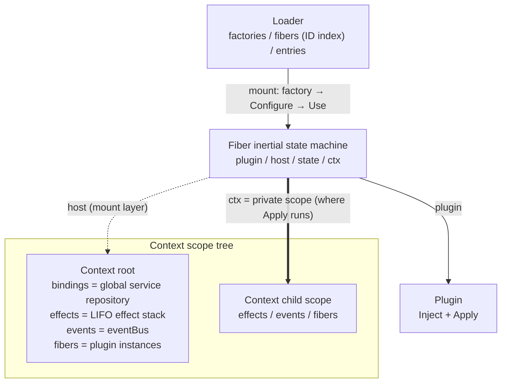
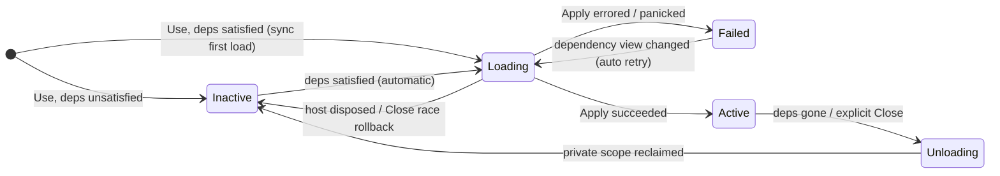

[English](README.md) | [中文](README_zh.md)

# kernel

The plugin kernel of pulse v2: the foundation where everything is a plugin.

This package brings [cordiverse/paper](https://github.com/cordiverse/paper)'s *A Programming Paradigm for Spatiotemporal Composability* to Go: **unload reverts the effect** (time) + **dependency-reactive loading** (space). It is not a verbatim port of Cordis. For the full trade-offs, see [`docs/design/plugin-kernel-v2.md`](../docs/design/plugin-kernel-v2.md).

After reading this you should be able to: create scopes, Provide/Get services, write a plugin, reconcile configuration with the Loader, and subscribe to the three event kinds.

## What It Solves

If a component's modifications to its environment are cleaned up through developer discipline, unload leaks them. If components rely on hand-ordered startup sequences, any dependency change scrambles the whole tree.

The kernel uses the same `Context` to remember both "what exists now" and "what has been changed":

| Dimension | Meaning | Implementation |
|---|---|---|
| Temporal composability | Unload reverts the effect | Every mutation registers an undo function as an `Effect`; on scope `Dispose` they unwind in LIFO order |
| Spatial composability | Dependency-reactive | `Plugin.Inject` declares dependencies; satisfied → load, gone → unload, restored → reload. No manual startup sequence |

Where the core concepts live in the source:

| File | Concept |
|---|---|
| `context.go` | `Context`: service repository + effect tracker + scope tree |
| `service.go` | `ServiceKey[T]`: type-safe service keys, `Provide` / `Get` |
| `events.go` | `EventKey[P]`: `On` + `Emit` / `Waterfall` / `Parallel` + Local |
| `plugin.go` | `Plugin` / `Fiber`: declaration and inertial lifecycle |
| `loader.go` | `Loader`: declarative entries + incremental `Reconcile` |
| `diagnostics.go` | `FiberStateChange` / `LoaderAction` typed events and diagnostic names |
| `snapshot.go` | `FiberSnapshots` read-only whole-tree snapshot (for the banner) |

## Structure Overview and Call Chains

The skeleton is a Context tree: every scope has an event bus, an effect stack, and a fiber table, but the **service repository lives only in the root** — `Provide` / `Get` locate the root repository via `root()`; the scope tree owns lifecycle and event propagation, not service visibility.



Three chains cover all interactions:

1. **Assembly chain**: `Reconcile` runs in three phases (locked diff → unlocked mount/Close → locked commit) → `mount` = factory → `Configure` → `Use` (loader.go:217) → `settleSync` synchronous first load → `doLoad` = `host.Derive()` builds a private scope + `plugin.Apply(ctx)` (plugin.go:257). Everything registered inside Apply (services, listeners, effects) lands in that private scope — unloading means disposing it.
2. **Reactive chain**: any `Provide` or binding removal → `notifyServiceChange` broadcasts tree-wide (context.go:278) → the change subscription registered by `Use` filters against the fiber's declared dependency names (plugin.go:132) → on a hit, `markDirty` → the single-flight `settleLoop` re-evaluates (plugin.go:226): dependencies satisfied → `doLoad`, missing → `doUnload`. Disposing the private scope removes bindings, which **broadcasts again** — unloading cascades downstream naturally.
3. **Destruction chain**: `Dispose` in a fixed order (context.go:180): snapshot and mark under lock → `forceUnload` local fibers (**silent, no fiber_state**) → cascade child scopes in reverse → clear the event bus → remove itself from the parent → unwind effects LIFO.

Fiber states and their triggers (`from == to` emits nothing; tree destruction is silent throughout):



## 1. Scopes and Effects

```go
ctx := kernel.New()
defer ctx.Dispose() // 根销毁 → 子作用域逆序级联回收 + 本层效应 LIFO unwind
```

`Derive` derives a child scope: it shares **global** service bindings and event broadcast; registrations on the child are withdrawn on `Dispose`, and the child removes itself from the parent. If the host is already disposed, `kernel.ErrDisposed` is returned.

Any reversible side effect goes through `Effect`. `Provide` / `On` ultimately reduce to an `Effect` as well:

```go
undo, err := ctx.Effect(func() (func(), error) {
    ln, err := net.Listen("tcp", ":0")
    if err != nil {
        return nil, err
    }
    go http.Serve(ln, mux)
    return func() { ln.Close() }, nil
})
// undo() 可提前撤销（幂等）；没手动调的，Dispose 兜底。
```

Returning a nil `undo` from a successful `apply` is legal — it declares that the effect **needs no restoration**; registration proceeds as usual and the kernel substitutes a no-op (the dispose path never panics). But an `apply` that holds reversible resources (file descriptors, connections, goroutines, etc.) **must** return an undo: forgetting it leaks silently, and the kernel cannot verify reversibility on the caller's behalf.

On a disposed scope, `Effect` / `Derive` / `Use` all return `ErrDisposed`.

## 2. Services: Provide / Get

The service namespace is **globally unique**; bindings live in the root-scope repository (aligned with the Cordis runtime-store). The scope tree governs lifecycle and event propagation, **not "who can see whose provides"**.

```go
var Key = kernel.NewServiceKey[string]("pulse.example")

ctx := kernel.New()
defer ctx.Dispose()

dispose, err := kernel.Provide(ctx, Key, "hello")
if err != nil { /* ... */ }
_ = dispose // 可提前撤；ctx.Dispose 也会撤

v, ok := kernel.Get(ctx, Key) // ok==false 表示未提供
```

Overwriting the same name = unload the old and load the new, **without reverting the previous value** (backed by tests). The same name with a different type is rejected at `Provide`. Prefix names with the package, e.g. `pulse.llm`.

## 3. Plugins: Use / Fiber

```go
type Plugin interface {
    Inject() []kernel.Dependency // 全部满足才装载
    Apply(c *kernel.Context) error
}

func Require[T any](k kernel.ServiceKey[T]) kernel.Dependency
func Func(apply func(c *kernel.Context) error) kernel.Plugin // 零依赖适配
```

`Apply` receives the instance's **private scope**: everything it `Provide`s / `On`s / `Effect`s there is reclaimed automatically on unload. An `Apply` error → the Fiber enters `Failed`.

```go
type Greeter struct{}

func (p *Greeter) Inject() []kernel.Dependency {
    return []kernel.Dependency{kernel.Require(Key)} // Key 见上一节
}
func (p *Greeter) Apply(c *kernel.Context) error {
    v, _ := kernel.Get(c, Key)
    fmt.Println("greet:", v)
    return nil
}

host := kernel.New()
defer host.Dispose()

_, _ = kernel.Provide(host, Key, "world")

fiber, err := kernel.Use(host, &Greeter{})
if err != nil {
    // 宿主已销毁 → ErrDisposed，fiber == nil
    // Apply 失败 → err 非 nil，fiber 仍返回且处于 Failed，依赖变化后会自动重试
}
_ = fiber.State() // inactive / loading / active / unloading / failed
```

`Use` returns `(*Fiber, error)`. The first load is **synchronous**: with dependencies satisfied, the fiber is already `Active` on return; otherwise it is suspended as `Inactive`, waiting; a disposed host returns `ErrDisposed`.

Runtime dependency changes go through dirty-flagging + a single-flight goroutine (avoiding unload-cycle deadlocks under Go's synchronization model). `Use` is synchronous during assembly; at runtime, use `WaitState` to wait for convergence.

## 4. Loader: Declarative Reconciliation

The actual entry point is **`Reconcile`** (there is no `Load` / `LoadFile` / `LoadJSON`).

```go
loader := kernel.NewLoader(host)
if err := loader.Register("greeter", func() kernel.Plugin { return &Greeter{} }); err != nil {
    // 同名工厂冲突
}

err := loader.Reconcile([]kernel.Entry{
    {ID: "g1", Name: "greeter", Config: map[string]any{"lang": "zh"}},
})
// 单个条目失败不阻断其余；返回 errors.Join 聚合错误。
```

If an entry implements `Configurable`, `Reconcile` hands the entry's `Config` to the instance before `Use` — configuration is instance-private and does not enter the global service repository.

Reconciliation rules:

| Change | Behavior |
|---|---|
| New ID | Load |
| Removed ID | Unload and unregister |
| `Name` or `Config` changed | **Rebuild the whole instance** (no in-place diff) |
| Only `Disabled` toggled | Unload / restore, other fields untouched |

`MustRegister` panics on conflict; it is intended for package-level `init`.

### Choosing an Assembly Style

`Use` is the only loading primitive — the last step of `Loader.mount` is `Use` (loader.go:224). The Loader is an optional declarative layer on top of it that manages **entries**, not plugins: reactive loading/unloading, state-machine convergence, event dispatch, and effect reclamation all live in the Use/Fiber layer; bypassing the Loader breaks no invariant. The two assembly paths coexist by design — pick by assembly shape:

| Scenario | Expected usage |
|---|---|
| Library-embedded agents, CLIs, plugin set fixed at compile time | Direct `Use` — assembly code is the type-safe configuration |
| Multiple instances of one plugin, parameters from external config | Loader (`Configurable` private delivery, entries never overwrite each other) |
| Runtime hot-reload, conditional start/stop, disable with retained config | Loader (incremental reconcile, minimal disruption rebuilds) |
| Assembly shape decided by external input (config file / control plane) | Loader |

Boundary: the Loader only **observes** the state machine via `Snapshot` — transitions cannot be driven from outside; `(*Loader).Fiber(id)` consults the Loader's own ID index, while the whole-tree snapshot `FiberSnapshots` walks host.fibers and never touches the Loader. When a bundle-level host (CLI/server booting a system from config) lands, the Loader becomes the entry point of that path (see the "deliberate trade-offs" section of the design doc).

## 5. Events

Observer-style listeners use **`On`**; waterfalls use **`OnWaterfall`**. There is no `OnParallel`: `Emit` and `Parallel` share `On`.

| Dispatch | Listener | Semantics |
|---|---|---|
| `Emit` | `On` | **Synchronous, in registration order**. `*P` mutates in place, and earlier listeners' changes are visible to later ones (a synchronous Go call is already serial, so no separate Serial is added) |
| `Waterfall` | `OnWaterfall` | around: `next(p)` delegates to the remaining listeners; not calling `next` short-circuits. In registration order |
| `Parallel` | `On` | Each listener runs concurrently on an **independent copy**; panics are collected into `[]error`, indexed by listener order |

```go
var Tick = kernel.NewEventKey[int]("pulse.example.tick")

_, _ = kernel.On(ctx, Tick, func(n *int) { *n++ })           // Emit / Parallel
_, _ = kernel.OnWaterfall(ctx, Tick, func(n int, next func(int) int) int {
    return next(n) + 1
})

kernel.Emit(ctx, Tick, 0)              // 同步累积
_ = kernel.Waterfall(ctx, Tick, 0)     // around 链回流
_ = kernel.Parallel(ctx, Tick, 0)      // 并发；返回 []error 或 nil
```

Event names are globally unique; the same name with a different type is rejected at registration. Waterfalls **do not support prepend**. Listeners are removed automatically when their scope is disposed. When `On` and `OnWaterfall` are mixed, the two kinds dispatch independently and do not interfere.

Dispatch has two layers (see [`docs/design/kernel-local-events.md`](../docs/design/kernel-local-events.md)):

| API | Semantics | Use case |
|---|---|---|
| `Emit` / `Waterfall` / `Parallel` | Broadcast from root across the whole tree | Host-level observation (e.g. fiber_state / loader_action) |
| `EmitLocal` / `WaterfallLocal` | This scope only, not to parent/child/siblings | Request-scoped facts (tool / turn / HITL / llm generate) |

In `Emit`, a single listener panic **propagates upward**; `Parallel` collects panics into errors. `EmitLocal` / `WaterfallLocal` are safe on a nil scope (no-op / returns the input unchanged).

## Deliberately Pinned

- The service repository is globally unique; no visibility across Context trees is by design.
- Overwrites do not revert the previous value.
- Lock order is fixed: `ctx.mu → bus.mu`; `bus.mu` is the leaf lock.
- Two assembly paths coexist by design: `Use` is the only loading primitive; the Loader does not funnel it (it manages entries, not the state machine).
- No realm / isolate, no code-level HMR. A Loader "reload" = dispose the old Fiber + rebuild from the same factory.

## Exported API at a Glance

Positioning: the plugin foundation. Design: unload reverts the effect + dependency-reactive. Every symbol below is usable on its own.

**Scopes**

| Symbol | What it does | How to use |
|---|---|---|
| `New` | Creates the root scope | `ctx := kernel.New(); defer ctx.Dispose()` |
| `(*Context).Derive` | Derives a child scope | Shares global services; child `Dispose` reclaims only itself. Already disposed → `ErrDisposed` |
| `(*Context).Dispose` | Cascading disposal of this layer and descendants | LIFO-unwinds effects |
| `(*Context).Effect` | Registers a reversible side effect | `apply` returns `undo` (nil = declares no restoration, no-op fallback); call `undo()` early, or `Dispose` cleans up; reversible resources must return an undo |
| `(*Context).Parent` | Parent scope | Root returns nil |
| `ErrDisposed` | Operating on a disposed scope | `errors.Is(err, kernel.ErrDisposed)` |

**Services**

| Symbol | What it does | How to use |
|---|---|---|
| `ServiceKey[T]` | Type-safe service key | Package-level `var Key = NewServiceKey[*T]("pulse.x")` |
| `NewServiceKey` | Creates a key | Name it with a package prefix |
| `(ServiceKey).Name` | The key's registered name | Diagnostics, dependency filtering |
| `Provide` | Writes to the global repository | Returns a dispose; overwrites do not revert the previous value; same name with a different type errors |
| `Get` | Reads | `(v, ok)`; not provided → `ok==false` |

**Plugins**

| Symbol | What it does | How to use |
|---|---|---|
| `Plugin` | `Inject` + `Apply` | Apply's Context is a private scope |
| `Dependency` / `Require` | Declares a dependency on a `ServiceKey` | `Inject() []Dependency{Require(Key)}` |
| `Func` | Adapts a zero-dependency function into a Plugin | `kernel.Func(func(c *Context) error { ... })` |
| `Use` | Loads onto a host | `(*Fiber, error)`; disposed host → `ErrDisposed` with fiber==nil; Apply failure still returns the fiber (Failed, retryable) |
| `Fiber` | Running instance | Inertial state machine |
| `FiberState` / `String` | inactive/loading/active/unloading/failed | `fiber.State().String()` |
| `(*Fiber).State` | Current state | |
| `(*Fiber).Err` | Why `Apply` failed | nil unless Failed |
| `(*Fiber).Close` | Unloads and removes proactively | Idempotent |
| `(*Fiber).WaitState` | Waits for a target state or timeout | Empty `targets` = wait until not loading/unloading |

**Loader**

| Symbol | What it does | How to use |
|---|---|---|
| `Loader` / `NewLoader` | Declarative reconciler | Fibers hang under the host |
| `Entry` | `{ID, Name, Disabled, Config}` | ID is the reconciliation key |
| `Factory` | `func() Plugin` | Each load builds a fresh instance |
| `Configurable` | Receives Config | `Reconcile` calls `Configure` before `Use` |
| `Register` / `MustRegister` | Registers factories | Same-name conflict: error / panic |
| `Reconcile` | Turns the entry list into adds/removes/updates | One entry failing does not block the rest; returns `errors.Join` |
| `(*Loader).Fiber` | Fetches an instance by entry ID | Missing or Disabled → nil |
| `(*Loader).Snapshot` | `ID → state string` | Diagnostics / tests |

**Events**

| Symbol | What it does | How to use |
|---|---|---|
| `EventKey[P]` / `NewEventKey` | Type-safe event key | Package-level `var Tick = NewEventKey[int]("pulse.x.tick")` |
| `(EventKey).Name` | Event name | |
| `On` | Observer listener (shared by Emit / Parallel / Local) | `func(*P)`; registration is an effect |
| `OnWaterfall` | around listener | `func(P, next func(P) P) P`; not calling next short-circuits |
| `Emit` / `Waterfall` / `Parallel` | **Whole-tree** dispatch | Host-level observation; `Parallel` returns `[]error` or nil |
| `EmitLocal` / `WaterfallLocal` | **This scope only** | Request-scoped facts; nil-scope safe |
| `EventFiberState` / `EventLoaderAction` | Assembly-time typed event keys | Subscribe via the Bootstrap side channel; payloads are structs |
| `FiberSnapshots` / `FiberSnapshot` | Read-only whole-tree snapshots | For the banner; value types, no live pointers |
| `(*Fiber).Name` | Diagnostic name | Loader=`Entry.ID`; bare Use=TypeName#ordinal |

## Non-Goals

Realm, HMR, prepend, `OnParallel`, `Load`/`LoadFile`/`LoadJSON`, per-scope-isolated service visibility.
